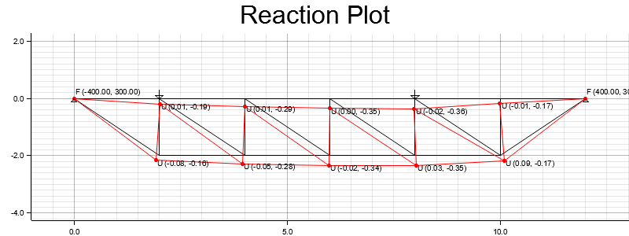

# rust-fe-calculator
A simple 2D Finite Element (FE) application written in Rust.

This application parses model inputs from `.txt` files, making it easy to modify and iterate on simulations.

> ⚠️ This project is currently in active development. Expect changes and improvements.

## Result Example


## How to Run
- Set files in the `inputs/` directory: `keypoints.txt`, `connections`, `pointloads` `boundary-conditions` (contains a preset simple structure as example).
- Set material parameters (`E`, `A`) directly in `main.rs`.
- Build and run the application using:
   ```bash
   cargo build
   cargo run
   ```

## Method
The application follows these steps:

- Parses inputs and loads them into Rust structs.
- Builds the global stiffness matrix **[K]** using keypoints and connection inputs.
- Constructs the global force vector **[F]** based on pointload inputs.
- Applies boundary conditions based on boundary definitions.
- Creates a global-reduced HashMap to correlate global stiffness matrix and force vector locations with a reduced format **[Kᵣ]** and **[Fᵣ]**, disregarding degrees of freedom where boundary conditions are applied.
- Solves displacements using reduced stiffness matrix and force vector.
  ```
  [uᵣ] = [Kᵣ]⁻¹ · [Fᵣ]
  ```
- Applies global-reduced HashMap to create global displacement vector **[u]**.
- Solves for global forces using the global stiffness matrix and global displacement vector.
  ```
  [F] = [K] · [u]
  ```

## Elements
- Bar elements (axial stiffness only).

## Tech Stack
- nalgebra – linear algebra for matrix/vector operations.
- Custom-built FE core logic.

## Future Implementation Ideas
- Spring stiffness boundary conditions.
- Support for beam elements (bending).
- Export of all keypoint results in json format.
- Various material parameters for elements (currently applying 1 hardcoded material)
- Scripting example of a large building
- Non-linear behaviour. Test gradient descent and Newton-Rhapson solvers.

